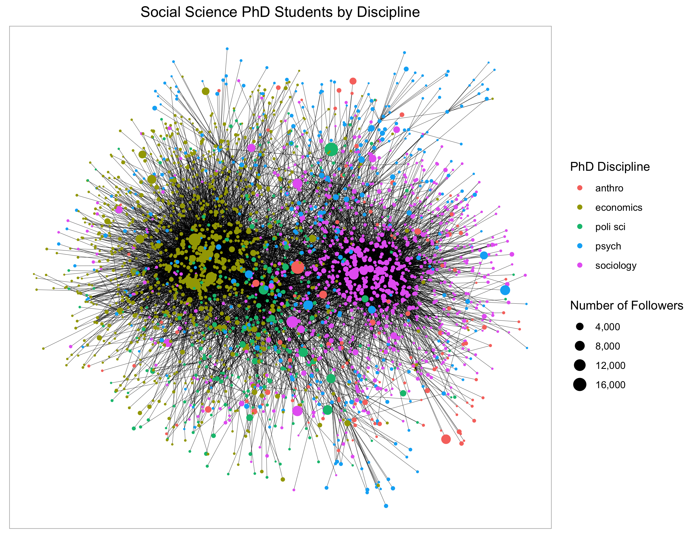

# twittercrawler
The twittercrawler R package provides a way to collect network data through Twitter's standard v1.1 APIs. To use this package, you will need API credentials. You can apply for these through Twitter's developer pages (https://developer.twitter.com/en/docs/twitter-api/getting-started/guide). 

The main function of the twittercrawler package is get_user_network.This function takes three required arguments: screen_name or id, degree, and token.The screen_name/id argument takes a Twitter user screen name or id.  The degree argument specifies the degrees of separation up to which the function collects user and network information.  For example, if I set degree to 2, the function will collect both friends of a given user and all of those friends' friends. Finally, the token argument takes the API token needed to access Twitter's APIs.  This is an object returned from twittercrawler's api_credentials_to_token function.  Here's a demonstration of how the package works.

```{r}
api_token <- api_credentials_to_token(app_name, consumer_key, consumer_secret, access_token, access_secret)

user_content <- get_user_network(id = "778619636510326784", degree = 2, token = api_token)
```

I stored the data returned from the get_user_network function as an object called user_content. This is a two-element named list. The first element, nodes, has data on the users in my network. The second element, edgelist, is an edgelist of my network connections. This can be used to create visualizations of my Twitter network. 

```
user_content
```

```{r}
## $nodes
## # A tibble: 85,757 x 10
##    id     screen_name  name  friends_count followers_count location description
##    <chr>  <chr>        <chr>         <int>           <int> <chr>    <chr>
##  1 77861… Andrew_Carr… Andr…            94             104 "Durham… "Sociology …
##  2 12716… RStatsJobsB… RSta…             1             707 ""       "Are you lo…
##  3 53854… CarenArbeit  Dr. …           228             401 "San Fr… "Sociologis…
##  4 30922… Effect_Altr… Effe…            60           15355 ""       "#effective…
##  5 36300… willmacaski… Will…          1183           27492 "Oxford" "Assoc Prof…
##  6 46955… GrahamDavidA Davi…          1887           34253 "Durham… "\"Dispirit…
##  7 16017… NateSilver5… Nate…          1378         3642961 "New Yo… "Founder, E…
##  8 11699… SamHarrisOrg Sam …           553         1470122 ""       "Author of …
##  9 10448… i_zzzzzz     Broo…           842           33899 "Montre… "Send me yo…
## 10 65934… eidlin       Barr…          1818            2650 "Montré… "Former org…
## # … with 85,747 more rows, and 3 more variables: url <chr>,
## #   profile_image_url <chr>, degree <dbl>
##
## $edges
## # A tibble: 120,094 x 2
##    from               to
##    <chr>              <chr>
##  1 778619636510326784 1271627871098941441
##  2 778619636510326784 538544281
##  3 778619636510326784 3092297686
##  4 778619636510326784 363005534
##  5 778619636510326784 46955476
##  6 778619636510326784 16017475
##  7 778619636510326784 116994659
##  8 778619636510326784 10448062
##  9 778619636510326784 65934237
## 10 778619636510326784 749397927462703105
## # … with 120,084 more rows
```

You can also use twittercrawler to collect subsets of a Twitter network based on user profile information. For instance, say you want to find all social science PhD students within four degrees of a Twitter user. You can choose to only collect users that have "phd student" or "phd candidate", along with the name of a social science discipline, somewhere in the description field of their Twitter profile. The filter_col argument takes the profile attribute (in this case, description) you want to filter on, and the filter_val argument takes the filter value. 

```{r}
# Making vector of social science disciplines 
ss_disciplines <- c("sociology|sociology", "economics|economics", "anthropology|anthropology", "political science|political science", "psychology|psychology")

ss_disciplines <- paste0("phd (student|candidate).*", ss_disciplines, ".*phd (student|candidate)")

# Final regex - description must have discipline following or followed by "phd student" or "phd candidate"
ss_disciplines_str <- paste0("(", paste(ss_disciplines, collapse = "|"), ")")

# Getting network of Social science PhD students
user_content <- get_user_network(screen_name = "Andrew_Carr24", degree = 4, token = api_token, 
                                 filter_col = "description", filter_val = ss_disciplines_str)
```

This data can be used to visualize the network structure of social science PhD students on Twitter.



For information on additional features of the twittercrawler package and some examples of the kinds of data you can collect with twittercrawler, check out the blog post on my [website](https://andrewcarr24.github.io/post/twittercrawler/twittercrawler_site.html).

